# 说明
1. 此文档主要用于梳理node exporter相关源码，大部分内容由**AI辅助生成+手工整理，仅供参考。**
2. 文档中大部分图由AI生成，手工修改，**并不一定规范**，仅用于理解代码。

# Node Exporter 工作原理分析：

## 核心架构
1. 主入口 node_exporter.go 中：

- 初始化命令行参数（metrics路径、最大并发请求等）
- 创建指标处理器 newHandler
- 启动HTTP服务器

2. 指标收集层：

- 通过 collector 实现各类系统指标采集
- 每个收集器实现 Collector 接口（Collect/Describe 方法）

## 工作流程

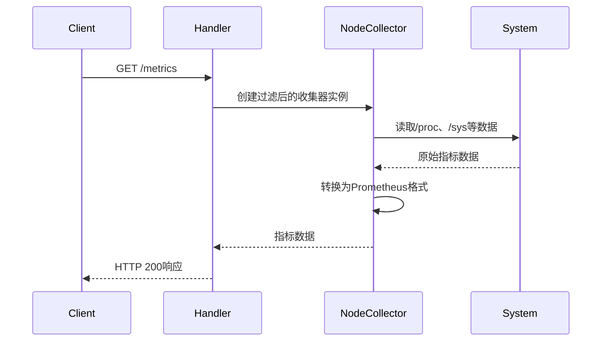
## 关键函数调用路径
1. main() → newHandler() 初始化核心处理器
2. handler.ServeHTTP() 处理请求：
- 解析 collect[]/exclude[] 参数
- 若无过滤条件，直接使用默认的`unfilteredHandler`处理请求：`unfilteredHandler.ServeHTTP(w, r)`。
- 若有过滤条件，调用innerHandler·动态创建新的指标处理器`filteredHandler`处理请求: `filteredHandler.ServeHTTP(w, r)`。
1. innerHandler() → collector.NewNodeCollector() 加载具体收集器
2. 各平台专属收集器（如 cpu_linux.go）实现指标采集

## 数据流向
1. 系统调用层：通过读取 /proc、/sys 等伪文件系统
2. 转换层：将原始数据转换为Prometheus指标格式
3. 暴露层：通过HTTP端点输出符合Prometheus规范的metrics数据

## 函数调用图
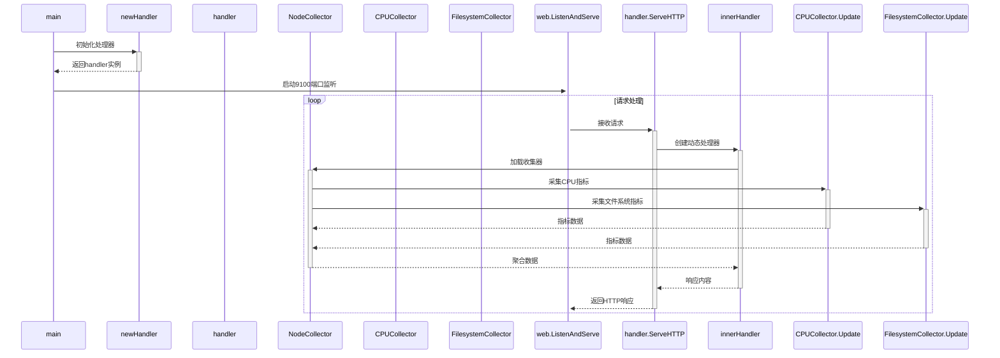
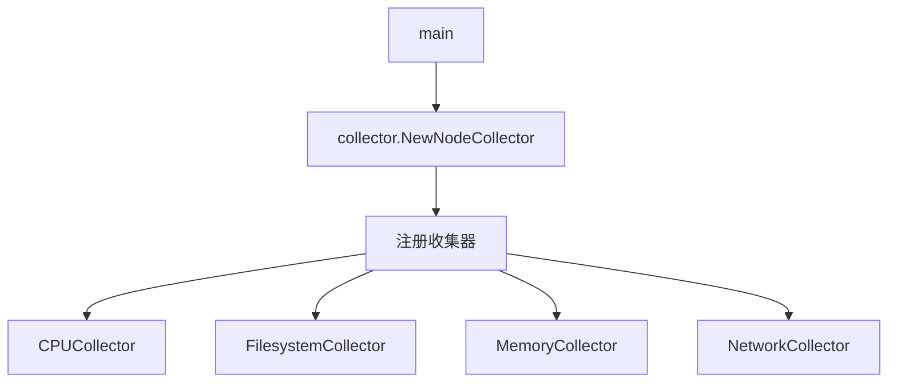
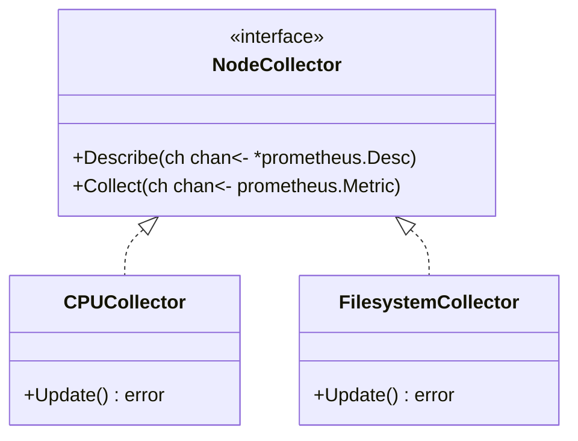

该图包含三个视角：

主流程时序图 - 展示HTTP请求处理全过程
收集器注册关系图 - 显示核心收集器的注册结构
类图简版 - 说明收集器接口实现关系
实际代码包含200+个函数调用关系，此图为简化版本聚焦核心路径。

## newHandler
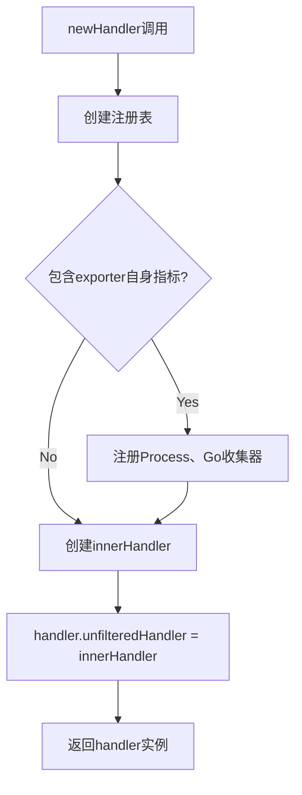

## innerHandler
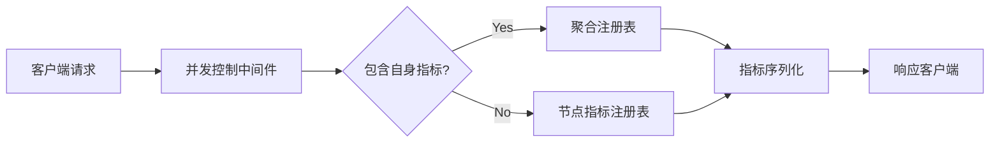
### 关键机制说明
1. 动态收集器加载：

- filters参数来自URL的collect[]查询参数
- 示例：/metrics?collect[]=cpu&collect[]=memory

2. 双注册表模式：

- h.exporterMetricsRegistry 跟踪导出器自身状态
- r 注册表专注节点指标
- 通过prometheus.Gatherers实现指标聚合

3. 错误韧性设计：
- ContinueOnError确保部分收集器失败不影响整体
- 日志通过slog.NewLogLogger适配传统logger接口

4. 中间件作用：
- InstrumentMetricHandler记录如下监控指标：
  - promhttp_metric_handler_requests_total
  - promhttp_metric_handler_requests_in_flight

## ServeHTTP
haproxy以`promhttp.Handler()`实现httpHandler，当访问/metrics端点时，`promhttp.Handler()`会自动调用已注册采集器的Collect方法。
```go
// 配置HTTP路由，配置API断点
	http.Handle(*metricsPath, promhttp.Handler()) // metrics端点
```
但node exporter以`net/http`实现httpHandler，需要实现`net/http`包的`Handler`接口。
```go
type handler struct {
	unfilteredHandler http.Handler
	// enabledCollectors list is used for logging and filtering
	enabledCollectors []string
	// exporterMetricsRegistry is a separate registry for the metrics about
	// the exporter itself.
	... ...
}

func newHandler(includeExporterMetrics bool, maxRequests int, logger *slog.Logger) *handler {
	// 初始化handler结构体
	h := &handler{
		exporterMetricsRegistry: prometheus.NewRegistry(), // 创建专属注册表
		includeExporterMetrics:  includeExporterMetrics,   // 配置开关
		maxRequests:             maxRequests,              // 并发控制
		logger:                  logger,                   // 日志实例
	}
    ... ... 
}

http.Handle(*metricsPath, newHandler(!*disableExporterMetrics, *maxRequests, logger))
```

ServeHTTP实现了`net/http`包的`Handler`接口:
```go
type Handler interface {
	ServeHTTP(ResponseWriter, *Request)
}
```
`node_exporter.go`中的`handler.ServeHTTP`是Node Exporter处理HTTP请求的核心方法，其作用流程如下：
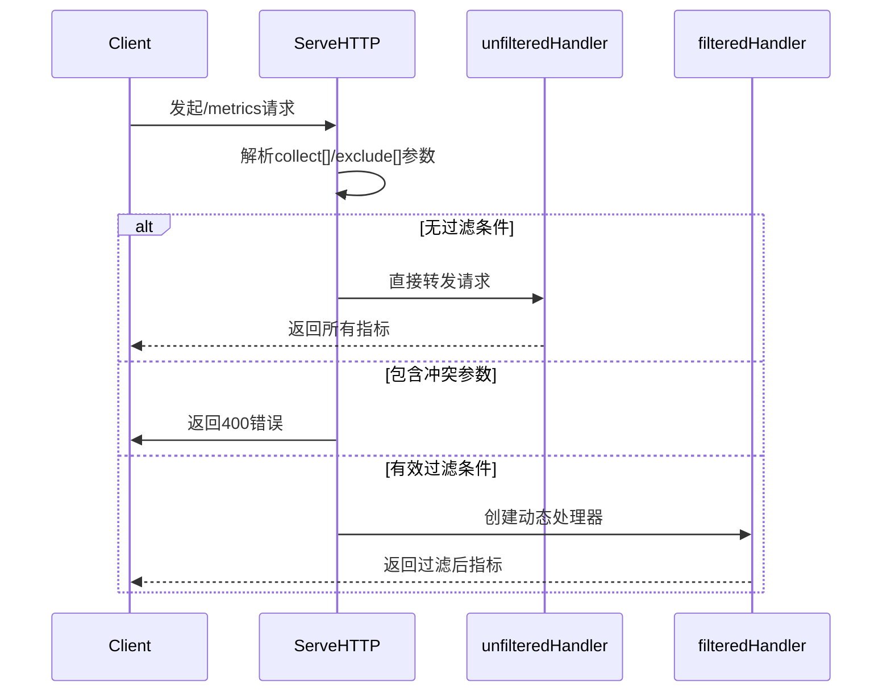
### 核心功能：
1. 请求参数解析：

- 处理collect[]（白名单）和exclude[]（黑名单）查询参数
- 示例请求：
  ```http://localhost:9100/metrics?collect[]=cpu&exclude[]=memory```

2. 请求路由决策：

- 无过滤条件时：使用预初始化的unfilteredHandler（全部采集器）
- 参数冲突时：立即返回HTTP 400错误（第99-104行）
- 有效过滤时：动态创建filteredHandler（第114-123行）

3. 动态处理器创建：

- 通过innerHandler方法生成特定过滤条件的处理器链（第116行）
- 包含注册表初始化、采集器加载等复杂逻辑

### 调用时机：
1. HTTP服务器初始化时注册到默认路由：

```go

http.Handle("/metrics", handler)
```

2. 当客户端访问以下地址时自动触发：
- 默认端点：`http://localhost:9100/metrics`
- 自定义配置端点（通过`--web.listen-address`和`--web.telemetry-path`参数）

### 关键设计特点：
1. 并发安全：

- 通过maxRequests限制并发处理数（第23行结构体定义）
- 防止高负载时资源耗尽

2. 日志追踪：

- 使用结构化日志记录请求参数（第88、90行）
- 帮助诊断采集过滤问题

3. 性能优化：

- 无过滤场景使用预编译的处理器（第95-97行）
- 避免每次请求都重新初始化采集器

### 典型调用栈示例：
```go
// 典型调用栈示例
main()
└── http.ListenAndServe()
    └── handler.ServeHTTP()  // 请求到达时
        ├── newHandler()        // 初始化时创建
        └── innerHandler()      // 动态创建过滤处理器
```

## 默认收集器的初始化与加载
### handler的enabledCollectors内容：
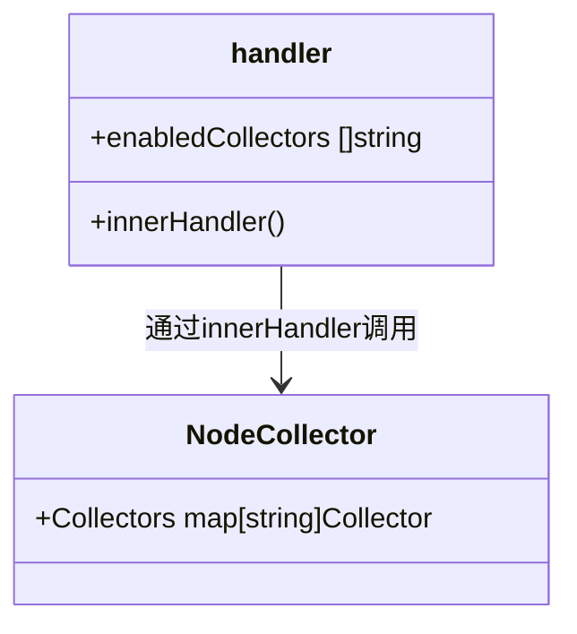

```go
func (h *handler) innerHandler(...) {
    if len(filters) == 0 {
        // 遍历所有启用的收集器
        for n := range nc.Collectors {
            h.enabledCollectors = append(h.enabledCollectors, n)
        }
        sort.Strings(h.enabledCollectors) // 字母排序
        // 日志记录所有启用的收集器
        h.logger.Info("Enabled collectors")
    }
}
```

#### 动态初始化原理：
1. 延迟加载机制：

- 避免在启动时加载所有收集器
- 按需初始化提升启动速度

2. 收集器注册系统：

- 各收集器通过init()注册（如collector/cpu_linux.go）
- 主程序通过NewNodeCollector加载

3. 运行时过滤支持：

- 通过collect[]参数动态过滤
- 保持原始列表完整性用于日志

### NodeCollector.Collectors初始化机制
在collector.go中，Collectors的初始化分为两个阶段：

1. 收集器注册阶段（程序启动时）：
```go
// collector.go
// 全局工厂注册表
// factories中存储了各收集器的工厂函数
// 每个收集器的工厂函数可创建对应的收集器实例
var factories = make(map[string]func(logger *slog.Logger) (Collector, error))

func registerCollector(collector string, isDefaultEnabled bool, factory func(...)) {
    // collectorState中声明对应收集器状态（是否enable）
    collectorState[collector] = flag
    // 将收集器工厂函数注册到全局map
    factories[collector] = factory
}
```
各子收集器通过init()注册（如cpu_linux.go）：

```go
// cpu_linux.go
func init() {
    registerCollector("cpu", defaultEnabled, NewCPUCollector)
}
```
2. 运行时初始化阶段（首次请求处理）：

```go
// 收集器状态跟踪
var (
    // 各收集器init()时更新collectorState和factories
    collectorState = make(map[string]bool)
    // 初次调用NewNodeCollector时，创建各收集器实例，并存储至initiatedCollectors
    initiatedCollectors = make(map[string]Collector)
)

func NewNodeCollector(logger *slog.Logger, filters ...string) (*NodeCollector, error) {
    // 1. 当filter不为空时，过滤启用的收集器 
    // 2. 创建各收集器实例并更新至initiatedCollectors
    collectors := make(map[string]Collector)
    for key, enabled := range collectorState {
        // 校验相关代码

        // 非初次创建收集器实例时
        if collector, ok := initiatedCollectors[key]; ok {
            collectors[key] = collector
        } else {
            // 初次创建新收集器实例时
			
            // 各收集器init()时会调用registerCollector
            // registerCollector会将内容注册到factories
            collector, err := factories[key](logger.With("collector", key))
            if err != nil {
                return nil, err
            }
            collectors[key] = collector
            // 当initiatedCollectors中不存在该收集器实例时，将其添加到initiatedCollectors
            initiatedCollectors[key] = collector
        }
    }
    return &NodeCollector{Collectors: collectors}, nil
}
```
关键时序流程：

```mermaid
sequenceDiagram
    participant node_exporter.go
    participant collector目录内程序
    participant handler.innerHandler()
    participant NodeCollector()

    node_exporter.go->>collector目录内程序: 程序启动
    collector目录内程序->>factories、collectorState: 各子收集器init()注册

    node_exporter.go->>handler.innerHandler(): main()函数
    handler.innerHandler()->>NodeCollector(): 创建NodeCollector实例
    
    alt initiatedCollectors无相关收集器实例时
        NodeCollector()->>factories、collectorState: 基于factories、collectorState<br>创建收集器实例
        factories、collectorState ->> initiatedCollectors: 更新initiatedCollectors
        factories、collectorState -->> NodeCollector(): 更新NodeCollector.Collectors
    else initiatedCollectors有相关收集器实例时
        NodeCollector() ->> initiatedCollectors: 直接访问initiatedCollectors<br>获取该实例
        initiatedCollectors -->> NodeCollector(): 更新NodeCollector.Collectors
    end
    %% initiatedCollectors ->> NodeCollector(): 
    %% NodeCollector()->>factories: 遍历注册表
    %% factories-->>NodeCollector(): 返回所有工厂函数
    %% NodeCollector()->>collectorState: 实例化收集器
```
#### 设计特点：
1. 延迟初始化：

- 避免启动时加载所有收集器
- 按需初始化节省资源
2. 线程安全：

- 使用sync.Mutex保护并发访问
- initiatedCollectorsMtx锁机制（第53行）
3. 动态过滤：
- 通过filters参数控制实际启用的收集器

### 各收集器`init()`函数执行机制
在Node Exporter中，各收集器的`init()`函数调用遵循Go语言的包初始化规则：
1. 导入触发阶段：
```go
// node_exporter.go
import (
    _ "github.com/prometheus/node_exporter/collector" // 匿名导入触发初始化
)
```
2. 执行顺序：
- 包级别变量初始化
- `init()`函数按文件字母顺序执行
- 示例收集器初始化顺序：

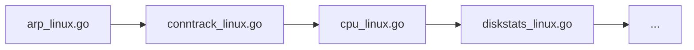
注册过程：

```go
// arp_linux.go
func init() {
    registerCollector("arp", defaultEnabled, NewARPCollector)
}
```
#### 关键代码路径：
1. 主程序入口：node_exporter.go第18-25行（包导入）
2. 各收集器注册调用`registerCollector()`：`collector/collector.go`第59-75行
3. 运行时验证：

```bash
# 查看实际初始化顺序
go build -x 2>&1 | grep 'running init'
```
**设计特点：**
1. 自动注册机制：

- 避免手动维护收集器列表
- **新增收集器只需实现init()**
2. 并发安全：

- 使用initiatedCollectorsMtx互斥锁（collector.go第53行）
- 防止并行初始化冲突
3. 按需编译：

- 通过构建标签控制平台特定收集器
-示例：`diskstats_openbsd_amd64.go`第1行`//go:build amd64 && openbsd`


## `tools/main.go` 函数作用
这是 node_exporter 工具模块的入口函数。主要功能包括：

1. 命令行参数解析：

```go
matchCmd := flag.NewFlagSet("match", flag.ExitOnError)
switch os.Args[1] {
case "match":
    // 处理 match 子命令
```
2. 构建环境匹配检测（match 子命令）：

```go
ctx := build.Context{
    GOOS:   goos,
    GOARCH: goarch,
}
match, err := ctx.MatchFile(filepath.Dir(abs), filepath.Base(abs))
```
该工具用于验证文件是否满足指定 GOOS/GOARCH 的构建条件（通过 // +build 编译标签判断），匹配成功返回 0 退出码，失败返回 1。这是 node_exporter 构建系统用来过滤平台特定源码的辅助工具。


## Collector 接口

### Describe 函数：

```go
// Describe 实现 prometheus.Collector 接口
func (n NodeCollector) Describe(ch chan<- *prometheus.Desc) {
    ch <- scrapeDurationDesc  // 注册抓取耗时指标描述符
    ch <- scrapeSuccessDesc   // 注册抓取成功状态指标描述符
}
```

#### 调用时机：

- 初始化阶段由Prometheus registry**注册收集器时**自动调用
- Prometheus 服务**发现新 target 时**
- **指标元数据需要更新时**

### Collect 函数：

```go
// Collect 实现 prometheus.Collector 接口
func (n NodeCollector) Collect(ch chan<- prometheus.Metric) {
    wg := sync.WaitGroup{}
    wg.Add(len(n.Collectors))
    for name, c := range n.Collectors {
        go func(name string, c Collector) {
            execute(name, c, ch, n.logger) // 并行执行收集器
            wg.Done()
        }(name, c)
    }
    wg.Wait()
}
```

**execute 函数关键逻辑（伪代码）：**
```plaintext
记录开始时间
执行 对应收集器的 Update() 获取指标
计算耗时并生成 scrapeDuration 指标
根据执行结果生成 scrapeSuccess 指标
将所有指标发送到通道
记录错误日志（如有）
```
#### 调用时机：

- 客户端**请求 `/metrics` 端点时**（每次 scrape 请求）
- Prometheus 根据配置的 scrape_interval **定期触发**
- **指标数据需要刷新时**（实时性要求高的场景）

1. HTTP Handler触发： 当Prometheus server访问/metrics端点时 → promhttp.HandlerFor() → Collect() (遍历所有注册的collectors, 调用各collector的Collect())
**说明**：innerHandler就是通过promhttp.HandlerFor()创建http Handler。
2. 并发执行机制： 在Collect()方法中创建的goroutine会通过execute函数触发具体指标收集：

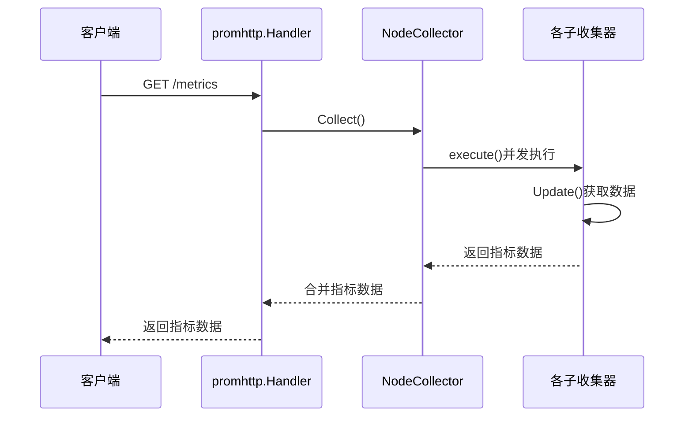
#### 核心机制：

- 并发执行模式：通过 goroutine 并行运行所有收集器
- 同步控制：使用 WaitGroup 等待所有收集器完成
- 错误隔离：单个收集器失败不会影响整体流程
- 指标通道：通过 ch 通道异步发送指标数据

### 关键差异：

- Describe 是元数据注册（低频调用）
- Collect 是实际数据采集（高频周期性调用）


# ARP收集器 `arp_linux.go`

## `init()`
init函数是ARP收集器的注册入口，主要完成：
```go
func init() {
    // 向收集器注册中心登记ARP收集器
    registerCollector(
        "arp",          // 收集器名称
        defaultEnabled,  // 默认启用状态（true/false）
        NewARPCollector  // 工厂函数
    )
}
```
### 三个关键参数说明：

1. "arp"：收集器名称，对应启动参数--collector.arp
2. defaultEnabled：布尔值，定义在文件头部控制默认启用状态
3. NewARPCollector：收集器构造函数，**在`NewNodeCollector`中被调用**

该注册操作使得：

1. ~~主程序启动时会通过loadCollectors加载所有已注册的收集器(有待确认）~~
2. 用户可以通过`--no-collector.arp`参数显式禁用该收集器

### 完整调用链：

1. main() → NewNodeCollector()
2. NewNodeCollector()直接遍历collectorState映射获取收集器启用状态
3. 对每个启用的收集器，通过`factories`映射调用对应的构造函数
4. 工厂函数（如`NewARPCollector`）在此处被实际调用

## NewARPCollector()
```go
func NewARPCollector(logger *slog.Logger) (Collector, error) {
	// 1. 初始化procfs文件系统访问
	fs, err := procfs.NewFS(*procPath)
	if err != nil {
		return nil, fmt.Errorf("failed to open procfs: %w", err)
	}

	// 4. 返回完整的收集器实例
	return &arpCollector{
		fs: fs,
		// 2. 创建设备过滤器
		deviceFilter: newDeviceFilter(*arpDeviceExclude, *arpDeviceInclude),
		// 3. 构造指标描述符
		entries: prometheus.NewDesc(
			prometheus.BuildFQName(namespace, "arp", "entries"),
			"ARP entries by device",
			[]string{"device"}, nil,
		),
		logger: logger,
	}, nil
}
```

### 关键组件说明：

1. `procfs.NewFS()`：通过procfs包访问Linux的**/proc虚拟文件系统**
2. `deviceFilter`：基于编译参数`--collector.arp.device-exclude`和 `--collector.arp.device-include`生成的设备过滤规则
3. `entries`描述符：最终会生成指标`node_arp_entries`，包含`device`标签
4. 返回的`arpCollector`会通过Collect方法定期收集`/proc/net/arp`文件数据

## `Update()`
`Update()`是ARP收集器的核心方法，主要完成以下功能：

1. 数据采集：根据`arpNetlink`配置选择采集方式

- 启用时通过`getTotalArpEntriesRTNL()`获取ARP条目
- 禁用时通过`fs.GatherARPEntries()`读取`/proc/net/arp`

2. 数据处理：

- 统计每个网络接口的ARP条目数量
- 过滤被忽略的设备（deviceFilter.ignored）

3. 指标生成：

- 为每个有效设备创建Prometheus指标
- 通过prometheus.MustNewConstMetric发送到指标通道

### 函数调用图
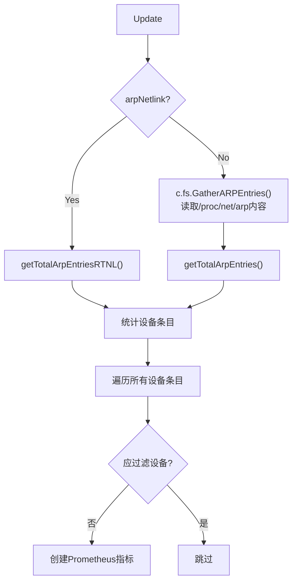

## `getTotalArpEntriesRTNL()`
```go
// 使用RTNL（路由网络链接库）建立原始套接字连接
func getTotalArpEntriesRTNL() (map[string]uint32, error) {
    conn, err := rtnl.Dial(nil) // 创建原始netlink套接字
    if err != nil {
        return nil, err
    }
    defer conn.Close() // 确保函数返回前关闭连接

    // 获取IPv4协议的邻居表（ARP表），过滤掉IPv6
    neighbors, err := conn.Neighbours(nil, unix.AF_INET)
    if err != nil {
        return nil, err
    }

    entries := make(map[string]uint32) // 创建接口名→ARP条目数的映射

    for _, n := range neighbors {
        // 跳过NUD_NOARP状态条目（不需要ARP解析的邻居）
        if n.State&unix.NUD_NOARP == 0 { 
            entries[n.Interface.Name]++ // 统计每个接口的ARP条目
        }
    }

    return entries, nil
}
```

关键点解析：

1. RTNL连接：通过rtnl.Dial()创建原始netlink套接字，这是Linux内核与用户空间通信的标准方式
2. 协议过滤：unix.AF_INET限定只处理IPv4地址，因为ARP是IPv4特有的协议
3. 邻居状态过滤：NUD_NOARP状态表示该邻居条目不需要ARP解析（如静态配置），这类条目会被排除统计
4. 接口统计：通过n.Interface.Name获取网络接口名称，使用map实现接口级别的ARP计数

该函数在node_exporter中的作用是为`arp_entries`指标提供每个网络接口的ARP缓存条目数，这些指标会被Prometheus抓取后用于Kubernetes集群的网络监控。

补充说明：

- 使用defer确保网络连接正确关闭
- 该实现比解析/proc/net/arp更高效，**直接通过内核接口获取数据**
- 统计结果会通过Prometheus的Gauge类型指标暴露，格式为：
```go
node_arp_entries{interface="eth0"} 25
```